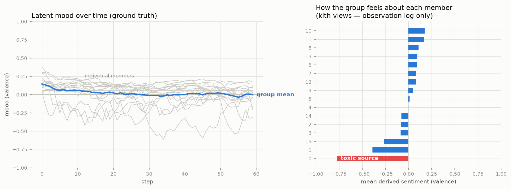

# Emotional contagion — reconstructed from memory alone

A team of agents talks over a small-world network. One member is a
persistent negative source; emotion spreads by contagion (receivers drift
toward the valence they receive). Every exchange is recorded into kith as
an `affect` observation — *how did this interaction feel* — by the receiver.

The demo then throws away all ground truth and asks kith's derived views
three questions:

1. **How does the group feel about each member?** — per-dyad sentiment,
   aggregated
2. **Who is the source?** — rank members by how negatively they are
   perceived; the toxic agent lands at the pole (correct on 5/5 seeds)
3. **Why do you say so?** — `view.explain()` traces every sentiment score
   to the exact observations behind it

```bash
python examples/contagion_viz/simulator.py                # terminal output
python examples/contagion_viz/simulator.py --png out.png  # + chart (matplotlib)
```



Left: latent moods (ground truth the memory never sees). Right: what
kith reconstructs from the observation log alone — the toxic source is
isolated at the negative pole.

Representative terminal output:

```
kith-derived sentiment (from observation log only):
  toward toxic source : -0.770  (n=3 dyads)
  toward everyone else: -0.001  (n=55 dyads)

source localization from memory alone: CORRECT
```

Why this matters:

- **The observation log is a longitudinal dataset.** Group emotion
  dynamics — contagion, polarization, source localization — become
  queries over kith views, not bespoke instrumentation. (This is the
  systems substrate for group-emotion-dynamics research; affect
  observations are schema-compatible with activation-level emotion
  probes.)
- **Scope still applies.** Every observation here is per-dyad and
  observer-owned; a member's read on a peer is not group-visible unless
  granted. Diagnostics run *with* the privacy model, not around it.
- LLM-free, seeded, seconds to run — like the
  [delegation demo](../delegation_sim/), the subject under test is the
  memory substrate.
